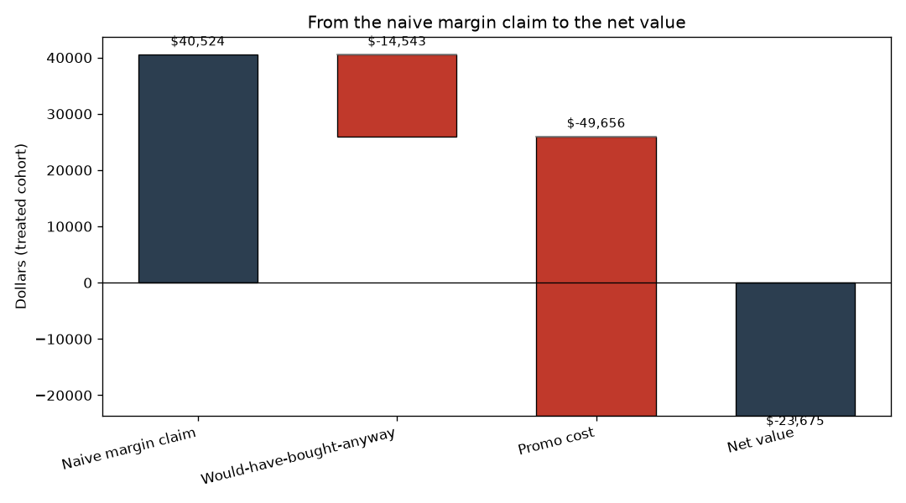
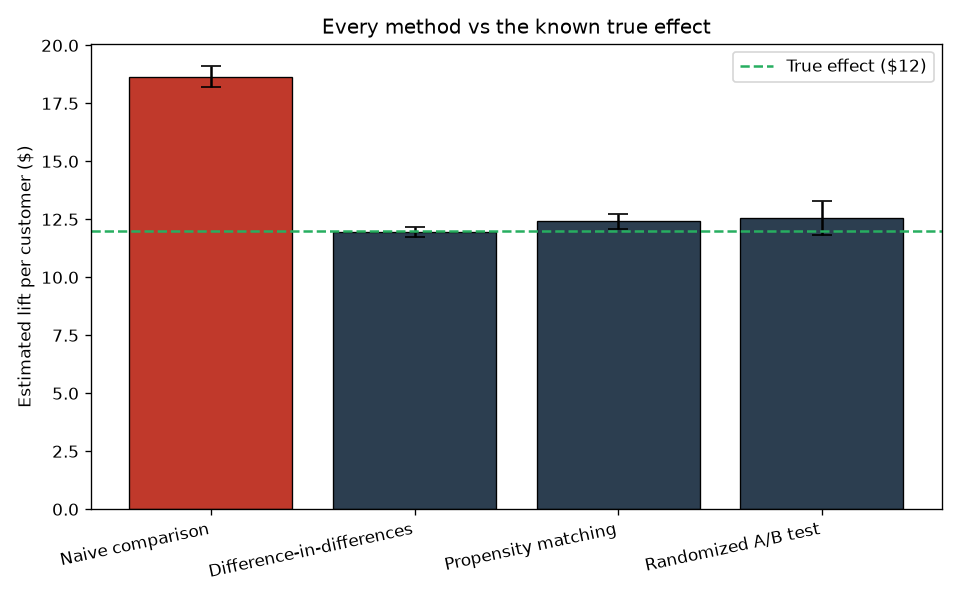

# Did the promotion actually work?

A retailer ran a promotion. The dashboard said treated customers spent about $18.65 more, roughly a 50% lift. The business was ready to scale it.

Three causal methods agree the true lift is only about $12. The missing $6.65 per customer is selection bias: the promo went to bigger historical spenders, people who would have bought anyway. Across the treated cohort, $14,543 of claimed margin subsidized buyers who needed no incentive. After the $8 per customer promo cost, the campaign destroyed $23,675 of value.

**Recommendation: kill the blanket promotion.** The lift is real but too small to pay for the discount. Retarget to price-sensitive segments, test a smaller incentive, and re-run the experiment with the guardrails in this repo.



## The business question

Promotions are easy to run and hard to judge. When the customers who receive a promo are already your best buyers, a simple before/after or treated/control comparison will credit the promotion for purchases that were going to happen regardless. The question this project answers is the one a manager actually needs: how much of the observed lift did the promotion *cause*?

## What the analysis found

Every estimate below is validated against a known ground truth, because the data is synthetic with the true effect fixed at $12 per customer.



The naive comparison overshoots by $6.65. Difference-in-differences lands at $11.96, propensity-score matching at $12.41, and the randomized A/B test at $12.56. Three different identification strategies, one answer. That agreement is the whole point: any single method can be doubted, but three methods with different assumptions converging is evidence.

The guardrails tell the rest of the story. Net margin per customer is -$3.60 (fail), while the refund rate is unchanged (pass). A real lift that still loses money is exactly the case guardrails exist for.

Full numbers, diagnostics, and the pre-registered analysis plan live in [outputs/results.md](outputs/results.md) and [outputs/analysis_plan.md](outputs/analysis_plan.md).

## Why these methods

The promotion was not randomized in the observational data. High spenders were more likely to receive it, so the treated and control groups are not comparable on their face.

Difference-in-differences handles this by removing fixed group differences and any shared time trend, isolating the change that coincides with the promotion. The parallel-trends plot and the placebo test on pre-periods check the key assumption instead of assuming it.

Propensity-score matching attacks the same selection problem from a different angle. It rebuilds a comparable control group by pairing each treated customer with a lookalike, and the balance table shows the matching worked (standardized differences drop from around 0.44 to near zero).

The A/B test module covers the randomized arm end to end: a randomization check on pre-treatment covariates, a power calculation for sizing the test, the effect estimate, guardrail metrics on margin and refunds, and a pre-registered analysis plan written before looking at results.

## How to run it

```bash
pip install -r requirements.txt
python run.py
```

Everything is driven by `config.yaml`: sample sizes, the true effect, seeds, matching parameters, and the experiment economics. Change the config, rerun, and every number and plot updates. Run the test suite with `pytest`.

## Production notes

This is built to be rerun and extended, not just read.

* **Config-driven.** All parameters live in `config.yaml`. Seeds are fixed, so every run reproduces the same numbers bit for bit.
* **Logged, not printed.** The pipeline uses the `logging` module with timestamps and levels, so runs are auditable.
* **Tested against truth.** The pytest suite asserts each estimator recovers the known $12 effect within tolerance, checks the placebo pre-trend sits near zero, verifies the naive comparison is biased upward, and confirms the guardrail catches the money-losing promo.
* **CI on every push.** The GitHub Actions workflow installs dependencies, runs the test suite, and runs the full pipeline.

## Project layout

```text
causal-promo-lift/
  run.py                 # single entry point
  config.yaml            # all parameters
  src/
    data_generator.py    # synthetic panel + experiment, known true effect
    did.py               # difference-in-differences + parallel-trends plot
    psm.py               # propensity-score matching + balance diagnostics
    abtest.py            # randomization check, power, estimation, guardrails
    plots.py             # estimate comparison + economics waterfall
    pipeline.py          # orchestration, money math, recommendation
  tests/                 # pytest suite against ground truth
  outputs/               # plots, results summary, analysis plan
  .github/workflows/ci.yml
```

All data in this project is synthetic and labeled as such. No real customer or company data is used anywhere.
