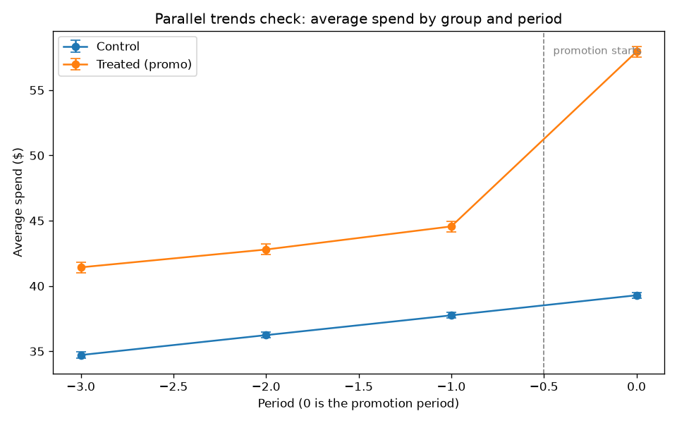
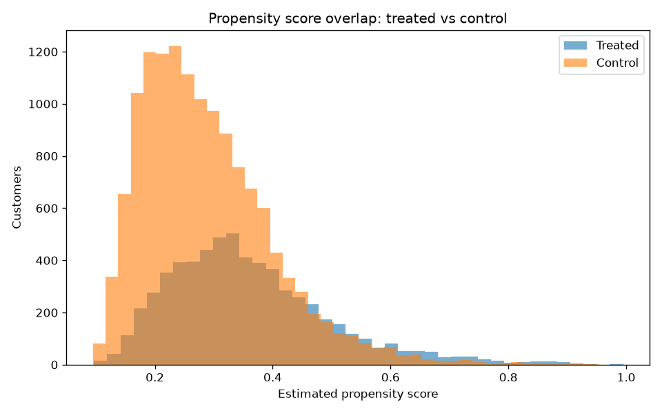

# Results: did the promotion actually work?

## Executive summary

A retailer ran a promotion and the dashboard showed treated customers spending $18.65 more (about +47%). Three causal methods agree the true lift is only about $11.96 (about +30%). The gap, $14,543 of margin across the treated cohort, went to shoppers who would have bought anyway. After the promo cost, the campaign's net value is $-23,675.

Recommendation: KILL the blanket promotion. The causal estimate shows the promo destroys margin after its cost: the lift is real but too small to pay for the discount. Reshape before any relaunch: retarget to price-sensitive segments, test a smaller incentive, and re-run the experiment with the guardrails in this repo.

## The money answer

All figures below come from synthetic data with a known treatment
effect of $12.00 per customer, so every method is checked
against ground truth instead of against another estimate.

Naive margin claim: $40,524.
Subsidy to would-have-bought-anyway buyers: $14,543.
True incremental margin: $25,981.
Promo cost (6,207 treated customers): $49,656.
Net value: $-23,675.

## Estimates vs ground truth

| Method | Estimate | 95% CI | Error vs truth |
| --- | --- | --- | --- |
| Naive comparison (no adjustment) | $18.65 | ($18.19, $19.12) | +6.65 |
| Difference-in-differences | $11.96 | ($11.75, $12.17) | -0.04 |
| Propensity-score matching (ATT) | $12.41 | ($12.09, $12.73) | +0.41 |
| Randomized A/B test | $12.56 | ($11.83, $13.29) | +0.56 |

## Diagnostics

Placebo pre-trend check (should sit near zero): 0.174 (se 0.113).
Matching kept 6207 of 6207 treated customers.
Sample size needed for 80% power: 27 per arm.

## Guardrails

Net margin lift per customer: $-3.60 (FAIL).
Refund rate change: +0.0006, p=0.927 (PASS).

## More plots

